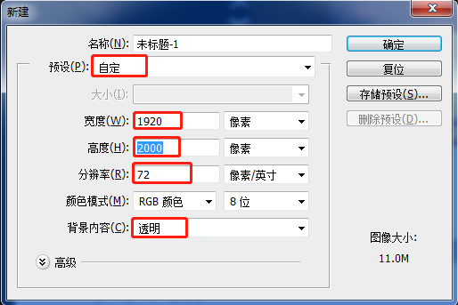

# Photoshop切图

https://www.cnblogs.com/padding1015/p/7085539.html

https://juejin.im/post/58ec558d570c350057e849f0

- ps界面设置
- ps基本操作
- ps传统切图
- ps精准切图
- 扩展知识介绍
- 总结

## ps 界面设置

### 新建设置

介绍网页设计中的初始化**尺寸参数**以及一些相关的**快捷键**。

文件-新建

### 移动工具设置

介绍移动工具针对网站前端的设置**属性**以及**快捷操作**。

1. 勾选上自动选择，并选择图层选项，点击设计稿，快速定位到点击图层。
2. 不勾选自动选择，只选择图层选项，按 `ctrl+点击`选中图层(推荐)。

### 视图设置

介绍针对前端在视图方面的设置以及设置中的**技巧和优势**。

在视图菜单中，勾选标尺和智能参考线。

在窗口菜单中，通过隐藏和勾选，留下信息、字符、图层和历史记录4个切图常用面板。并设置信息面板。

编辑-首选项-单位与标尺，单位全部改为像素。

设置完后使用

若选择的是图形，ctrl+单击psd快速定位到图层，在 ctrl+单击左侧表示区域，快速获取图层信息，省去手动测量。

选择文字图层，同样的方式可以获得字体、大小、字高、颜色，利用css书写。

保存设置

窗口-工作区-新建工作区

## ps 基本操作

- 简单工具操作
  - 介绍 ps 最基本的工具操作及其技巧。
- 图层的原理及其操作
  - 介绍 ps 中图层的基本原理以及结合工具的操作技巧。
- 参考线及其辅助
  - 介绍如何灵活运用参考线做辅助操作。

### 简单工具操作1

放大 `ctrl +  '+'` `ctrl+鼠标滚轮`

缩小 `ctrl +  '-'` `ctrl+鼠标滚轮`

拖拽 `空格 + 鼠标`

#### 移动(V)

#### 选区(M)

4种模式(正常、加、减、交叉)

选区扩展：椭圆、单行、单列(一个像素)

小技巧

- 画正方形、正圆：shift+选区操作。

- 以某点为中心画选区：alt+选区操作(+shift就是正方形或正圆)。
- 增减选区快捷键：shift+画选区，增加选区;alt+画选区，减少选区。
- 切换椭圆和矩形选区快捷键：按 shift + m 。

#### 套索

套索工具也是选区工具

小技巧

- 增加选区，按 shift + 套索
- 减少选区，按 alt + 套索

扩展：多边形套索工具、磁性套索工具

多边形套索工具：通过线段构建选区(若线段不闭合，通过双击鼠标闭合)

磁性套索工具：通过颜色自动区分边界(可以多个工具配合使用，通过 shift添加)

#### 快速选择

选择闭合的颜色相的选区

扩展：魔棒(**常用**)

> 选区、套索和快速选择工具都是选区工具。

#### 裁剪

裁剪图层

通过鼠标选择需要裁剪的区域

小技巧：

- 先通过移动工具快速选中圈选中图层，再选择裁剪快速裁剪我们需要的图层。
- 通过选区与裁剪的结合，裁剪出来的是包含选区的最小矩形区域。
- 获取单独图层的显影模式：例如圈选文字图层，裁剪后，alt+点击该图层可见按钮，得到显影模式，导出透明的 png 图片。

裁剪扩展：透视裁剪工具、切片工具、切片选择工具

#### 吸管

利用吸管吸取颜色，并在前景色中获取。

#### 小结

这六个工具是一组。

### 简单工具操作2

8个工具

#### 污点修复画笔工具

用于照片处理

扩展：修复画笔工具、修补工具、内容感知移动工具、红眼工具(内筒和红眼更多用于修照片)

修复画笔工具：alt+点击取材点，另选取区域进行复制操作。

修补工具： 圈选区域，拖动到相似区域，进行修复。

#### 画笔

在大小和硬度(越高越清晰)可以在属性栏中配置。

扩展：铅笔工具。

铅笔工具：硬度设置成0%，也依然是生硬的，画笔才会模糊。

#### 仿制图章

与修复画笔工具的区别，印章是一模一样的，修复画笔画完之后会有羽化处理。

#### 历史记录画笔

可以快速去斑

#### 橡皮擦

橡皮擦，自动选中删除

扩展：背景橡皮擦(背景擦成透明)、魔术橡皮擦(自动选区再删除)

#### 渐变

#### 模糊

用于照片修复

扩展：锐化、涂抹

#### 减淡

颜色减淡

扩展：加深、海绵

### 简单工具操作3

4个工具

#### 钢笔

画图形路径，可用于选区。

#### 文字

扩展：横排、直排、横直排蒙版

#### 路径选择

用钢笔画完路径后，可以用路径选择工具调整。

扩展：直接选择

#### 矩形

快速绘制图形

扩展：圆角矩形、椭圆、多边形、直线、自定义

#### 抓手

扩展：旋转视图

#### 缩放

小技巧：h+鼠标左键，快速放大指定区域。

### ps 图层的原理及其操作

前景色填充 alt+del，背景色填充 ctrl + del

原理：图层根据顺序依次覆盖

### ps参考线及其辅助

显示标尺：ctrl+r

新建参考线：从x/y标尺拖动；删除参考线: 在移动工具下拖回标尺；按住alt键可以改变参考线方向。

新建参考线快捷键：alt+v+e

显示隐藏参考线：ctrl+;

## ps 传统切图

- 切图与切片
  - 切图与切片的基本概念和区别。
- 切片的基本操作以及技巧
  - 介绍切片工具及其基本操作。
  - 介绍切片时候的一些技巧。
- 导出操作
  - 存储为Web所用格式。

### 切图与切片

一个一个切片

基于参考线切片：用参考线分割图片，用切片工具基于参考线切片。不需要的地方可以右键删除切片。

推荐：先裁剪，再切，事半功倍

**保存图片**

文件-存储为Web所用格式，选择png-24(用的较多)，存储，选择所有切片

