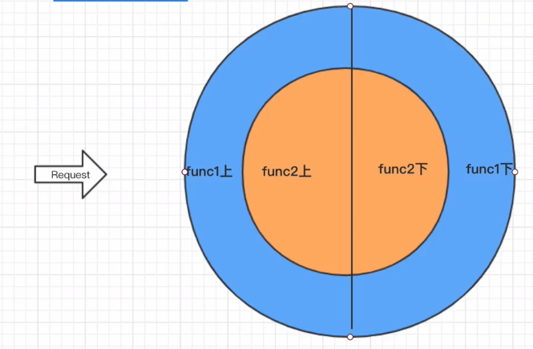

# 纯正商业级应用 Node.js Koa2开发微信小程序服务端

## 第 1 章 导学与 node.js

### 1-1 纯正商业级应用 Node.js Koa2开发微信小程序服务端

**讲什么**

- 二次开发 KOA
- KOA 不好用
- egg.js think.js

- 校验器 LinValidator
- 全局异常处理
- 自动路由注册
- KOA 核心机制
- 为什么要有洋葱模型？
- 中间件到底怎么样？
- JS、ES6、ES7中高级语法的应用
- 查找类(Class) 上的属性和方法
- 异步编程模型
- 深入 async 和 await
- 编程思维与面向对象
- Sequelize 与 MySQL
- KOA 示范项目
- Web 分层结构
- 完型填空
- 开源项目 Lin CMS 开发后端管理(不讲)
- Vue + KOA
- https://github.com/TaleLin

**前端为什么要学 node.js**

Node.js能力

- 脱离浏览器运行 js
- NodeJS Stream (前端工程化基础)
- 服务端 API
- 作为中间层

是否学 node.js 取决于定位

- 纯前端不需要
- CTO 由服务端工程师担任
  - 需要设计整个公司技术架构
  - 需要从全局考虑问题
  - 需要掌控公司最重要的资产：数据(谁掌握数据，谁才有话语权)

独立完成一个项目、产品

面试加分

前后端界限越来越模糊

- 双层结构：前端+服务端
- 三层结构：前端+后端+服务端(操作管理数据库)
- 前端自己编写 API

思维培养

- 前后端思维方式不同
- 更加成熟，考虑问题更加全面
- 学习服务端对于提高前端编程也很有帮助

### 1-2 异步、JavaScript特性与 NodeJS

**异步**

flask django 同步

KOA 使用 async await，而早期的 express 写异步代码很痛苦

前端涉及异步不多，如 http 请求

服务器端涉及异步较多，如 http 操作数据库等

**JS 特性**

语言简洁 es2019 < python

js 基于原型链 工程化 OO面向对象

**node.js**

使 js 脱离 浏览器

使用场景 node.js > python

### 1-3 申请 AppKey

http://www.7yue.pro/course

aRo3t9zJDjpKCfr3

### 1-4 旧岛小样业务分析

### 1-5 课程维护及更新说明

公众号： 林间有风

慕课：手记

## 第2章 Koa2的那点事儿与异步编程模型

### 2-1 软件与环境

### 2-2 node一小步，前端一大步

**Node.js 的能力与应用**

1. 脱离浏览器运行 js
2. NodeJS Stream (前端工程化基础)
3. **服务端 API**
4. 作为中间层

### 2-3 KOA的精简特性与二次开发必要性分析

后端：读写数据库 API

写出好的代码、提高开发效率，学好后端时间成本大，如悲观锁、乐观锁、事务、脏读、幻读等。

node.js 不只用于 web，node.js 的 api 比较低级、基础，不适合直接进行 web开发。

有基于 node.js 专业开发 Web 框架，如早起的 Express 和 后来的 KOA

KOA：洋葱圈模型、精简，因为精简，直接用难用，需要二次开发。

### 2-4 模块加载、ES、TS、Babel 浅析

项目初始化

```shell
npm init - y
```

安装 koa

```shell
npm i koa
```

### 2-5 KOA的中间件

根目录创建 app.js，作为应用程序入口

生成一个 Koa 实例，作为**应用程序对象**，它有很多中间件。

注册中间件，可以具名和可以匿名(推荐)。

匿名写法中，koa 会自动传入两个参数，ctx 和 next。ctx 是上下文对象，当要执行多个中间件时，通过 next() 执行。

当我们访问 localhost:3000 时， 这两个中间件会执行。

```js
const Koa = require('koa')
// app 称为应用程序对象，它有很多中间件
const app = new Koa()

// 具名方式
// function test () {
//   console.log('skjdflsdjf')
// }
// 注册中间件
// app.use(test)

// 注册中间件，推荐匿名写法
app.use((ctx, next) => {
	console.log('hello world')
	next()
})
app.use((ctx, next) => {
  console.log('hello world2')
})

// 前端发送 HTTP，KOA 接收 HTTP

app.listen(3000)

```

### 2-6 洋葱模型

当前端请求 localhost:3000时，console.log 执行顺序如下。

结果：1、3、4、2，执行1进入next，执行3，进入next，没有，继续执行4，然后继续执行2

```js
// app.js
const Koa = require('koa')
const app = new Koa()

app.use((ctx, next) => {
	// 洋葱模型
	console.log(1);
	next()
	console.log(2);
})
app.use((ctx, next) => {
	console.log(3);
	next()
	console.log(4);
})

app.listen(3000)
```

洋葱模型



加上 async await 保证洋葱模型

```js
app.use(async (ctx, next) => {
	// 洋葱模型
	console.log(1);
	
	await next()
	console.log(2);
	
})
app.use(async (ctx, next) => {
	console.log(3);
	await next()
	console.log(4);
})
```


