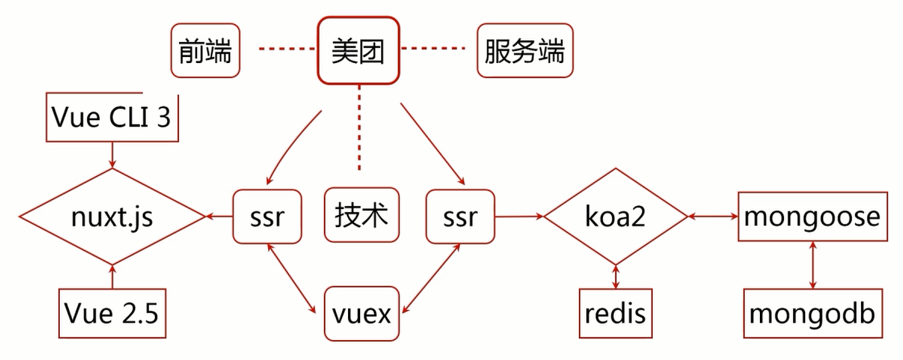

# vue美团

## 项目简介

### 业务内容

- 首页
- 登录/注册
- 产品列表
- 产品详情
- 购物车
- 订单

### 技术内容



### 主要内容


## vue基础

自定义指令应用场景：一个功能没有复杂到用组件去做，又不是一个表达式能解决的，这时候用自定义指令最合适。

## 第3章 Koa2基础知识
- koa-generator
- async和await语法
- koa2中间件
- koa2路由
- cookie和session
- mongoose基础
- redis基础

### 3-1 Koa-generator

安装

```shell
npm install -g koa-generator
```

创建项目

```shell
koa2 project
```

默认是以jade模板引擎安装的

通过 -e 设置项目模板引擎是 EJS，创建项目，根据提示运行项目，就可以在localhost:3000访问了

```shell
koa2 -e project
```

如果希望改服务端代码自启动，用 `npm run dev`启动项目，对应的dev script脚本中 配置了 nodemon

关于启动脚本

start 和 test，可以直接运行 npm start 启动，而其他脚本命令必须用 npm run ...

### 3-2 Koa异步async

- 异步的概念
- 理解async和await

async 和 await：用同步的方式解决异步的问题。

await 后跟的是 Promise，若不是 Promise 会转换成 Promise

```js
router.get('/testAsync', async (ctx) => {
  global.console.log('start', new Date().getTime()) // time1
  const a = await new Promise((resolve, reject) => {
    setTimeout(function () {
      global.console.log('async a', new Date().getTime())
      resolve('a')
    }, 1000)
  })
  // const b = Promise.resolve(123)
  const b = 123


  ctx.body = {
    a,
    b
  }
  
})
```

### 3-3 Koa中间件

- koa2中间件的原理
- 自定义koa2中间件


**自定义koa2中间件**

创建一个中间件 middleware/koa-pv.js

```js
function pv(ctx) {
    global.console.log('pv', ctx.path)
}

module.exports = function() {
    return async function(ctx, next) {
        pv(ctx)
        await next() // next() 的作用是继续执行下一个中间件
    }
}
```

并在app.js中使用这个中间件

```js
const Koa = require('koa')
const app = new Koa()
const pv = require('./middleware/koa-pv')

app.use(pv())
```

刷新浏览器，向服务器发送请求，会输出 console.log的结果，证明中间件执行了

**koa2中间件的原理**

代码的顺序从上到下，引用的顺序可以不一样，但是都会运行到。

定义三个中间件，m1 m2 m3

```js
function m1(ctx) {
    global.console.log('m1') // m2 m3
}

module.exports = function() {
    return async function(ctx, next) {
        global.console.log('m1 start') // m2 start m3 start
        m1(ctx)
        await next()
        global.console.log('m1 end') // m2 end m3 end
    }
}
```

在app.js 中使用

```js
const Koa = require('koa')
const app = new Koa()
const pv = require('./middleware/koa-pv')

app.use(pv())
app.use(m1())
app.use(m2())
app.use(m3())
...其他中间件
```

刷新页面，服务端会打印出如下内容，运行顺序符合洋葱模型，最开始的中间件运行后，最后还是可以会运行，形成一个闭环。


