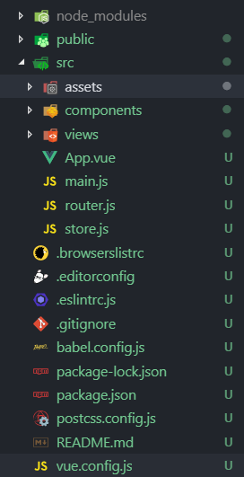

# vue 技术栈开发实战

课程源码：https://github.com/lison16/vue-cource

## 使用 vue-cli3创建项目

- 使用 Vue UI 创建、管理项目
- 项目结构目录整理
- 初始文件添加
- 基本配置
- 跨域配置

### 使用 Vue UI 创建、管理项目

命令行打开 vue ui

```shell
vue ui
```

- 创建项目
  - 选择项目文件夹
  - 包管理器：npm
  - 下一步
- 预设
  - 选择手动
  - 下一步
- 功能
  - babel，勾选
  - vue-router，勾选
  - vuex，勾选
  - css预处理器，勾选
  - linter / formatter，勾选
  - 使用配置文件，勾选
  - 下一步
- 配置
  - 预处理器，选 less
  - linter / formatter 配置，选 eslint + standard config
  - lint on save，先关掉
  - 点击创建项目
- 是否保存预设
  - 不需要

### 项目结构目录整理



### 初始文件添加

**配置 .editorconfig**

```shell
root = true /# 使其生效 #/
[*] /# 对所有文件都有效 #/
charset = utf-8 /# 编码 utf-8 #/
indent_style = tab /# 缩进选择 tab，空格是 space #/
indent_size = 2 /# 缩进尺寸 #/

```

vscode 需要安装插件 EditorConfig for VS Code，安装后配置文件才会生效。

**添加 api 目录**

创建 /src/api/ 文件夹，作为请求文件的目录。

**整理 assets 目录**

添加 /assets/img/ 文件夹，存放图片。

添加 /assets/font/ 文件夹，存放图标字体。

**添加 config 目录**

创建 /src/config/ 文件夹，项目的配置文件，存放在 config文件夹中。

创建 /src/config/index.js 文件，并导出一个对象。

```js
export default {}
```

通过 import from '相对路径'，在其他文件中引入。

**添加 directive 目录**

创建 /src/directive/ 文件夹，用于存放自定义指令。

创建 /src/directive/index.js 文件。

**添加 lib 目录**

创建 /src/lib/ 文件夹。

创建 /lib/util.js 文件，用于存放与业务结合的工具函数。

创建 /lib/tools.js 文件，存放与业务无关的工具函数。

**添加 router 目录**

创建 /src/router/ 文件夹。

创建 /router/index.js 文件

将 router.js 移入文件夹。

拆分代码

```js
// index.js，存放路由实例，以及路由拦截等
import Vue from 'vue'
import Router from 'vue-router'
import routes from './router'

Vue.use(Router)

export default new Router({
  routes
})
// router.js，存放路由列表
import Home from './views/Home.vue'

export default [
	{
		path: '/',
		name: 'home',
		component: Home
	},
	{
		path: '/about',
		name: 'about',
		// route level code-splitting
		// this generates a separate chunk (about.[hash].js) for this route
		// which is lazy-loaded when the route is visited.
		component: () => import(/* webpackChunkName: "about" */ './views/About.vue')
	}
]
```

**添加 store 目录**

创建 /src/store/ 文件夹。将 store.js 移入文件夹。

创建根级别文件 /store/state.js 文件，/store/mutations 文件，/store/actions.js 文件。

创建模块级别文件 /store/module/user.js 文件，存放模块级别的 state、mutations、actions

将 store.js 改名为 index.js。

将各文件导入 index.js

```js
// index.js
import Vue from 'vue'
import Vuex from 'vuex'
import state from './state'
import mutations from './mutations'
import actions from './actions'
import user from './module/user'


Vue.use(Vuex)

export default new Vuex.Store({
  state,
  mutations,
	actions,
	modules: {
		user
	}
})
// module/user.js
const state = {
	//
}

const mutations = {
	//
}

const actions = {
	//
}

export default {
	state,
	mutations,
	actions
}
```

**添加 mock 目录**

创建 /src/mock/ 文件夹，用于模拟返回数据。
创建 /src/index.js 文件

安装 mockjs， `-D`作为开发依赖。

```shell
npm install mockjs -D
```
引入 mockjs
```js
import Mock from 'mockjs'

// 具体 mock 操作

export default Mock
```

**修改入口文件 main.js**

查看文件引入路径，保证路径正确。

### 基本配置与跨域配置

**配置 vue.config.js**

配置基础路径、目录别名、SourceMap、devServer 代理跨域。

```js
// vue.config.js
const path = require('path')

const resolve = dir => path.join(__dirname, dir)

const BASE_URL = process.env.NODE_ENV === 'production' ? '/iview-admin' : '/'

module.exports = {
	lintOnSave: false,
	baseUrl: BASE_URL,
	chainWebpack: config => {
		config.resolve.alias
			.set('@', resolve('src'))
			.set('_c', resolve('src/components'))
	},
	// 打包时不生成.map文件，减少体积，加快打包速度 
	productionSourceMap: false,
	devServer: {
		proxy: 'http://localhost:4000'
	}
}

```

## 路由基础篇

- router-link 和 router-view 组件
- 路由配置
  - 动态路由
  - 嵌套路由
  - 命名路由
  - 命名视图
- JS 操作路由
- 重定向和别名

### router-link 和 router-view 组件

点击 `router-link`组件，发生路由跳转，跳转路径由属性 to 决定。路由内容通过 `router-view`组件渲染到页面。

```html
<template>
  <div id="app">
    <div id="nav">
      <router-link to="/">Home</router-link> |
      <router-link to="/about">About</router-link>
    </div>
    <router-view/>
  </div>
</template>
```

### 动态路由

优点：组件复用、在同一组件处理不同逻辑