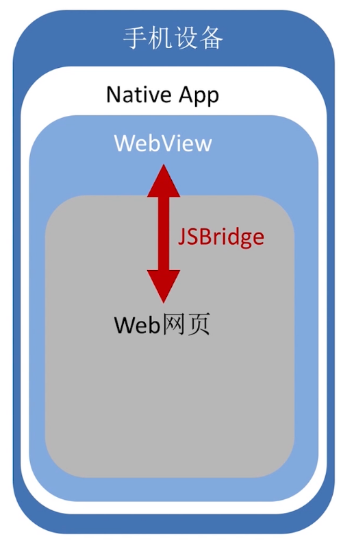
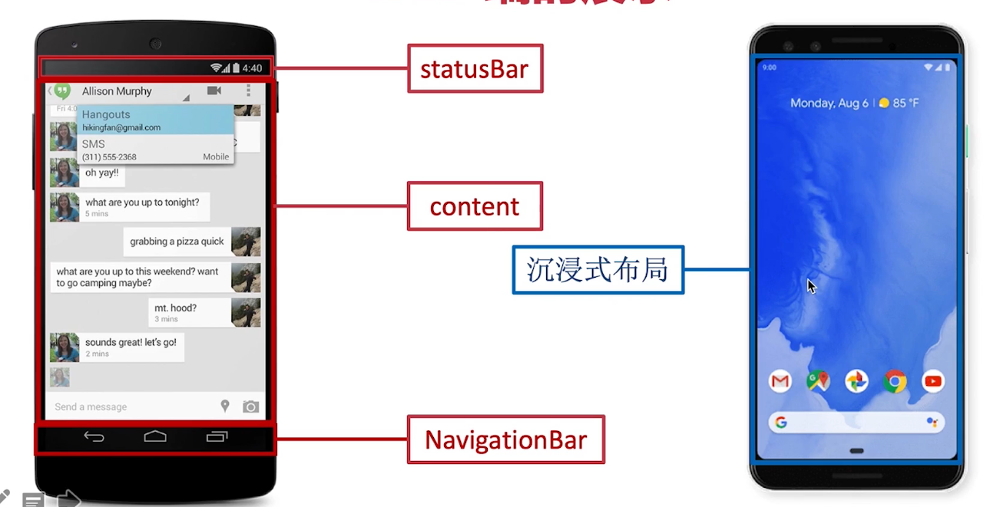

# vue 混合开发

## 第1章 课程介绍

###为什么学

**混合开发**：是一种开发模式，混合了Native(原生)技术和web技术进行开发的移动应用。

**现有的混合开发方案**

- React、ReactNative
- Week
- Flutter
- 小程序开发
- 移动应用混合开发框架
- PWA(Progressive Web App)

**学习基础**

- 在 Android、IOS中只会涉及与 WEB 跨语言通讯的内容
- 几乎所有的(除微信、支付宝支付)核心逻辑和 UI 都是在 VUE 中实现
- 原生端内容会模拟公司真实环境，提供与 WEB端的调用文档

**项目演示**

- 项目可在 Android、IOS、浏览器中运行
- Android 可直接扫码下载， IOS 因课程项目无法上架
- 网页课直接访问：http:://imooc.hybrid.lgdsunday.club/

**课程收获**

- 前端开发技术
- 混合开发的核心原理和跨语言通讯机制
- 前端项目的服务器部署

### 目前主流的混合开发方案

**Hybrid App**：是一种开发模式，混合了Native(原生)技术和web技术进行开发的移动应用。

现在流行的有**3种解决方案**：

- **基于 WebView UI (JSBridge)**，主要是通过 JSBridge 完成 web 端与 native 端的通讯，从而赋予 web 的原生能力
- **基于 Native UI (ReactNative、weex)**，在赋予 web 原生能力的基础之上，进一步通过 JSBridge 将 js 解析成虚拟节点树，并传递到 native 端，并使用原生进行渲染的方案。
- **小程序方案（微信、支付宝小程序）**，也是通过 JSbridge 实现的，这里对 JSbridge 进行了细节化的定制，并且隔离 js 逻辑层与 UI 渲染层，形成了特殊的开发环境从而加强了 web 和 native 的 融合程度，提高了 web 端的执行性能。

以上三种方案都是通过 **JSBridge** 完成通讯的，第二三种方案，可以看作是在第一种方案的基础之上，利用封装思想进一步加强 web 和 native 的融合程度**。**

**基于Webview UI** 

- 决定上层建筑的永远是底层基础
- 新的技术层出不穷，与其到处摸一把，不如抓其原理

 ## 第2章 Hybrid 技术原理

### 2-1 Hybrid App 的本质

- 在原生（Native）APP 中，使用 WebView 作为容器，来承载一个 web 页面。
- 原生（Native）和 web 端双向通讯层（跨语言解决方案）JSBridge

**JSBridge:**一座用 JS 搭建起来的桥，一端是 web，一端是 Native。让 Native 可以调用 Web 的 JS 代码，让 Web 可以调用 Native 的原生代码



用户需要一台手机设备，手机中有一个应用程序，所有网页内容是通过 Webview 展示 UI 及 业务逻辑，但是有一些原生特性功能，如数据存储。是无法通过 js 直接调用的，这时需要 JSBridge 作为桥，通过 JSBridge 通知原生端我们需要调用的功能，native 端在完成相应功能后，需要通过 JSBridge 来告诉 Web 端。

### 2-2 Andriod 与 Web 通讯 - Android 运行流程

## 第3章 开发前准备

- flex 布局
- Scss 预处理器
- Webpack 模块打包器
- @vue/cli3 脚手架

### Flex 布局

flex 弹性布局，拥有主轴与交叉轴。

#### 容器属性

**flex-direction(项目排序方向)**

> 注意，当方向改变后，主轴与交叉轴也会随之改变。

```css
.box {
  display: flex; 
  display: -webkeit-flex; /* 用来适配 webkit 内容的浏览器 */
  
  flex-direction: row; /* 默认值：项目从左到右依次排列，顶点在容器的最左侧 */
  flex-direction: row-reverse; /* 项目从右到左依次排序，顶点在容器的最右侧 */
  flex-direction: column; /* 项目从上到下依次排列，顶点在容器的最上侧 */
  flex-direction: column-reverse; /* 项目从下到上一次排列，顶点在容器的最上侧 */
}
```

**flex-wrap(是否换行)**

```css
.box {
  display: flex; 
  display: -webkeit-flex; /* 用来适配 webkit 内容的浏览器 */
  
  flex-wrap: nowrap; /* 默认值：表示项目不换行 */
  flex-wrap: wrap; /* 表示项目换行 */
  flex-wrap: wrap-reverse; /* 表示项目沿着交叉轴相反的方向进行换行处理 */
}
```

**justify-content(主轴对齐方式)**

```css
.box {
  display: flex; 
  display: -webkeit-flex; /* 用来适配 webkit 内容的浏览器 */
  
  justify-content: flex-start; /* ：项目会从主轴的起点开始沿着主轴的方向排列 */
  justify-content: flex-end; /* 项目会从主轴的终点开始沿着主轴的方向排列 */
  justify-content: center; /* 项目会在中轴的中心点去进行对齐，一次排列 */
  justify-content: space-between; /* 项目会在主轴的两端对齐，同时项目保持相同的间距 */
  justify-content: space-around; /* 所有的项目两侧间距相等。 （所以项目与容器的间距会比项目之间的间距小一倍） */
}
```

**aligin-items:(交叉轴对齐方式)**

```css
.box {
  display: flex; 
  display: -webkeit-flex;
  
  align-items: flex-start; /* 项目沿着交叉轴的起点进行对齐 */
  align-items: flex-end; /* 项目沿着交叉轴的终点进行对齐 */
  align-items:center; /* 项目沿着交叉轴的中心点进行对齐 */
  align-items: baseline; /* 当项目中存在文字时，项目沿着第一个项目内文字的基线进行对齐，当文字多行时，项目会以第一行文字为基线 */
  align-items: strech; /* 默认值：当项目没有设置宽度或高度，or高度或宽度设置为 auto 时，那么项目的宽度或高度会等于容器交叉轴的一个长度。 */
}
```

#### 项目属性

```css
.sub {
	order:0; /* 定义项目在容器中的排列顺序，数值越小，排列越靠前 */
  flex-grow: 0; /* 通过一个数值来定义项目的放大比例 */
  align-self: auto; /* 使项目在交叉轴上拥有单独的对齐方式，默认 auto，遵循容器 align-item */
}
```

### webpack 与 vue-cli

vue-cli创建项目


### SCSS 预处理起器

- SCSS 是 SASS 3.0 之后的称呼
- 强化 CSS 的辅助工具，在 CSS 的语法上增加了额外的功能（嵌套、变量、运算、函数......）

**对 CSS选择器的嵌套**

```html
<div class="box">
  <p class="box-desc">测试 scss 效果</p>
</div>
```

```scss
.box {
  background-color: aquamarine;
  p {
    color: red;
  }
  $-desc {
    font-size: 32px;
  }
}

/*
  .box {
    background-color: aquamarine;
  }
  .box p {
    color: red;
  }
  .box-desc {
    font-size: 32px;
  }
*/
```

**用来存储 CSS 中的信息**
```html
<div class="box">
  <p class="box-desc">测试 scss 效果</p>
</div>
```

```scss
$titleSize: 32px;
.box {
  background-color: aquamarine;
  p {
    color: red;
  }
  $-desc {
    font-size: $titleSize;
  }
}

/*
  .box {
    background-color: aquamarine;
  }
  .box p {
    color: red;
  }
  .box-desc {
    font-size: 32px;
  }
*/
```
**函数与运算**
- 自定义函数，用来计算想要的结果
```html
<div class="box">
  <p class="box-desc">测试 scss 效果</p>
</div>
```

```scss
@function doublePx($px) {
	@return $px * 2 + px;
}
$titleSize: doublePx(16);
.box {
  background-color: aquamarine;
  p {
    color: red;
  }
  $-desc {
    font-size: $titleSize;
  }
}

/*
  .box {
    background-color: aquamarine;
  }
  .box p {
    color: red;
  }
  .box-desc {
    font-size: 32px;
  }
*/
```

### rem 兼容性设置

计算场景

- 一套代码多种不同像素的设备
- 像素值 px 是一个绝对值
- 目标：定义相同文字的大小，但在不同设备上应该展示不同的像素数
- rem：相对于`<html>`标签元素 fontSize 大小的单位
- 根据屏幕的宽度定义根元素 fontSize 的大小
- 定义函数把像素转化为 rem

**fontSize 计算规则**

```js
// assets/js/htmlFontSize.js
// ES6 语法，直接运行需要在支持 ES6 的浏览器中，比如 chrome 浏览器
// 定义最大的 fontSize
const MAX_FONT_SIZE = 42;

// 监听 HTML 文档被解析完成的事件
document.addEventListener('DOMContentLoaded', () => {
	// 获取 html 标签
 	const html = document.querySelector('html');
  // 屏幕的宽度除以10，获取根元素 fontSize 标准。
  let fontSize = window.innerWidth / 10;
  // 获取到的 fontSize 标准不允许超过我们定义的最大值。
  fontSize = fontSize > MAX_FONT_SIZE ? MAX_FONT_SIZE ; fontSize;
  // 定义根元素 fontSize 的大小
  html.style.fontSize = fontSize + 'px';
})
```

**运算规则**

```scss
// assets/css/dimens.scss
// 以 Iphone 6、6s、7/8 为设计基础
// 定义预计根元素 fontSize
$rootFontSize: 375 / 10;
// 定义像素转化为 rem 函数
@function px2rem ($px) {
  @return $px / $rootFontSize + rem;
}
```

**初始化样式引入**

`https://meyerweb.com/eric/tools/css/reset/`

```css
/* assets/css/reset.css */
/* http://meyerweb.com/eric/tools/css/reset/ 
   v2.0 | 20110126
   License: none (public domain)
*/

html, body, div, span, applet, object, iframe,
h1, h2, h3, h4, h5, h6, p, blockquote, pre,
a, abbr, acronym, address, big, cite, code,
del, dfn, em, img, ins, kbd, q, s, samp,
small, strike, strong, sub, sup, tt, var,
b, u, i, center,
dl, dt, dd, ol, ul, li,
fieldset, form, label, legend,
table, caption, tbody, tfoot, thead, tr, th, td,
article, aside, canvas, details, embed, 
figure, figcaption, footer, header, hgroup, 
menu, nav, output, ruby, section, summary,
time, mark, audio, video {
	margin: 0;
	padding: 0;
	border: 0;
	font-size: 100%;
	font: inherit;
	vertical-align: baseline;
}
/* HTML5 display-role reset for older browsers */
article, aside, details, figcaption, figure, 
footer, header, hgroup, menu, nav, section {
	display: block;
}
body {
	line-height: 1;
}
ol, ul {
	list-style: none;
}
blockquote, q {
	quotes: none;
}
blockquote:before, blockquote:after,
q:before, q:after {
	content: '';
	content: none;
}
table {
	border-collapse: collapse;
	border-spacing: 0;
}
```

并在尾部添加以下样式

```css
/* assets/css/reset.css */
html,body {
  width: 100%;
  height: 100%;
  overflow: hidden;
  color: #333;
  /* 不指定为0，那么图片之间默认会有一个间距 */
  font-size: 0;
  /* 不允许去选中文本 */
  user-select: none;
}
```

给css文件夹指定一个入口文件

```scss
/* assets/css/style.scss */
@import './dimens/scss'
@import './reset' // 这里不加css扩展名，不然sass-loader解析时会报错
```

配置引用路径别名

```js
// vue.config.js
const path = require('path')

module.exports = {
  configureWebpack: config => {
    if (process.env.NODE_ENV === 'production') {
      // 为生产环境修改配置...
    } else {
      // 为开发环境修改配置...
      return {
        resolve: {
          alias: {
            '@js': path.resolve(__dirname, './src/assets/js'),
            '@css': path.resolve(__dirname, './src/assets/css'),
            '@img': path.resolve(__dirname, './src/assets/imgs'),
            '@c': path.resolve(__dirname, './src/components'),
          }
        }
      }
    }
  }
}
```

在main.js中引入js和css文件

```js
// main.js
import '@js/htmlFontSize.js'
```

public/index.html

修改viewport的meta，添加 ,maximun-scale=1.0最大缩放等级，user-scalable=no不允许用户对页面缩放

```html
<meta name="viewport" content="width=device-width,initial-scale=1.0, maximun-scale=1.0, user-scalable=no">
```

在vue组件中使用 fontSize

```vue
// Home.vue
<style lang="scss" scoped>
  @import '@css/style.scss';
  .test {
    font-size: px2rem(16)
	}
</style>
```

安装 scss 相关loader

```shell
npm install sass-loader node-sass --save-dev
```

## 第4章 京东商城首页（上）

**整体项目结构**

- WebView UI 的方式开发 Hybrid App
- 共分为：： Android、iOS、Web
- Android - Java、iOS - Object-C、 Web - Vue 组件化开发。

### 组件化开发思想与 toolbar 组件分析

**组件化开发思想**

- 组件化是一个思想不是一个具体的工具。
- 定义：每个页面都由多个组件构成，每个组件都应该具备一定的能力和约束。

**toolbar组件分析**

Toolbar 的功能：

1. 永远位于页面的最底部
2. 点击 toolbar 按钮时，页面发生对应的切换
3. 按钮分为 默认 和 选中两个状态

能力与约束

1. 不具备的能力（约束），如在顶部or底部
2. 通过一个回调，告诉父组件，按钮的点击事件。
3. 当按钮被选中时，应该切换按钮的状态。

### toolbar 实现

1.利用动态组件实现页面切换
2.注意嵌套组件的css样式设置，reset中有设置font-size为0消除图片间隙。

### 实现 swiper 组件

swiper官网：<https://www.swiper.com.cn/>

这里使用专属的vue-awesome-swiper:<https://github.com/surmon-china/vue-awesome-swiper>

> components文件夹下文件较多时，根据功能进行分类

**安装 vue-awesome-swiper**

```shell
npm install vue-awesome-swiper --save
```

**引入**

全局引入或组件中引入，这里直接在组件中引入

```vue
// require styles
import 'swiper/dist/css/swiper.css'

import { swiper, swiperSlide } from 'vue-awesome-swiper'

export default {
  components: {
    swiper,
    swiperSlide
  }
}
```

### axios 与 easyMock

安装 axios，`npm i axios`

配置 axios，即封装

```js
// axios 配置
import Vue from 'vue'
import axios from 'axios'

// 设置 axios 请求 baseUrl
axios.defaults.baseURL = 'http://api.imooc.hybrid.lgdsunday.club/'

/**
 * 设置拦截器，interceptors 响应处理，
 * 所有使用 axios 发送的请求，在请求发送出去之前，都会进入到方法中
 * 在这里，为所有请求添加上 token 。
 */
axios.interceptors.request.use(config => {
  // config.url = '/api' + config.url;

  // 当请求中存在 params 的时候，为 params 新增 token 字段
  if (config.params) {
    config.params.token = '私有'
  } else {
    // 当请求不存在 params 的时候，为它设置 params 对象
    config.params = {
      token: '私有'
    }
  }

  // 返回配置的 config
  return config
})

/**
 * 设置拦截器，interceptors 响应处理，
 * 所有使用 axios 的请求响应，都会优先回调到拦截器中
 * 在正确的返回情况下，数据会优先进入第一个回调方法
 * 在请求错误的情况下，错误会进入第二个回调方法
 */
axios.interceptors.response.use(
  response => {
    //  统一处理数据，使组件中的请求只获取到需要的业务数据，
    // 而不需要去关注返回的状态码等与业务无关的数据
    // console.log('响应拦截器');
    return response.data.data
  },
  error => {
    // 处理错误的响应
    return Promise.reject(error)
  }
)

//  绑定到 vue 原型中，组件中 ： this.$http -> axios。
Vue.prototype.$http = axios

```

### 数据接口替换

- easy-mock 服务器不稳定，导致接口请求经常失败
- 新接口增加 Token 验证

### axios同时发送多个请求

```js
this.$http.all([
  this.$http.get('/swiper'), 
  this.$http.get('/activitys')
]).then(this.$http.spread((swiperData, activityData) => {
    this.swiperData = swiperData.list.map(item => item.icon)
    this.activityDatas = activityData.list
  })
 )
```

## 第5章 京东商城首页（下）

### 秒杀组件开发

水平滚动轴overflow: hidden;overflow-x: scroll;
中间划线text-decoration: line-through;

### 商品价格过滤

使用vue的过滤器

```js
// filter.js
import Vue from 'vue'

/**
 * 金额数据处理
 * @param value 调用过滤器时，调用的文本
 */
Vue.filter('priceValue', function(value) {
  // 如果文本不存在，返回空字符
  // value === 0 ; !0 === true.
  if (!value) {
    return '0.00'
  }

  // 文本转化为 float
  let result = parseFloat(value)

  // 如果文本为 integer 类型的文本，表示当前文本没有小数
  if (Number.isInteger(result)) {
    return result
  }

  // 文本包含小数，result.toFixed(2)
  return result.toFixed(2)
})
```

在 main.js 中引入

```js
import '@js/filters.js'
```

在组件中使用，Seconds.vue

```vue
<p class="seconds-content-item-price">￥{{item.price | priceValue}}</p>
```

### 什么事瀑布流

- 多个宽度相同，但高度不同的 Item，按照从上到下，从左到右的顺序进行一次排列

**瀑布流核心概念**

- 宽度相同但高度不同的 Item。
- Item 以从上到下、从左到右的顺序进行依次排列。

瀑布流的布局：
1、创建商品列表的基本html 和 css ， 让 item 相对于 goods（div）进行排列(相对布局)
2、生成不同高度的图片，撑起不同高度的 item。
3、计算 item 的位置，来达到 从上到下，从左到右依次排列的目的

### navigationBar

能力：
1. 默认的展示效果 -> 左边后退按钮的图标、中间页面的名称、右边是空白的内容
2. 可通过插槽来配置具体的展示样式 -> 左、中、右 三个插槽，父组件可以通过这三个插槽来制定对应位置的布局。
3. 可以接收从外部指定的一个样式（可以在父组件中指定 navigationBar 的 style）。

## 第6章 商品列表项

### 商品列表页分析

路由懒加载打包结果

```js
   {
      path: '/goodsList',
      name: 'goodsList',
      // vue-router 懒加载 - > chunkName -> GoodsList.[hash].js
      // chunkName -> GoodsList.[hash].js
      component: () => import('./views/GoodsList.vue')
    },
```

首页中，商品列表单独滑动的问题，由于瀑布流计算了goods的高度，导致固定高的出现，设置为100%就可以和页面一起滚动了

## 第7章 商品详情与页面状态保存

```css
// 单行文本
.single-row-text {
    overflow: hidden;
    text-overflow: ellipsis;
    white-space: nowrap;
    display: inline-block;
}
```

## 第10章 与 native 交互

- WEB 端在 Native 中的展示
- WEB 和 Native 的互相调用

### 安卓的WEB端展示

现在流行沉浸式布局，webview占据整个屏幕的控件



### WEB 与 Native 的互相调用

- WEB 与 Android 的互相调用

- WEB 与 iOS 的互相调用

**互相调用涉及的主要内容**

- 自动登录

- 支付宝、微信支付

**自动登录**

- 当用户在应用中登陆过一次之后，当再次打开 APP 时，登录过的用户处于已登录状态。

**自动登录实现原理**

- 通过一个字段来标记唯一的指定用户
- 保存该标记到应用中
- 根据标记找到对应的登录用户

### 支付宝、微信支付基本流程

- 官方不推荐在 APP 中使用 H5 调起支付
- 支付宝、微信平台的注册商户才可以使用支付功能 

微信支付流程

微信开发平台->注册->登录->管理中心->创建移动应用

支付宝支付流程

### 对沉浸式布局的适配

