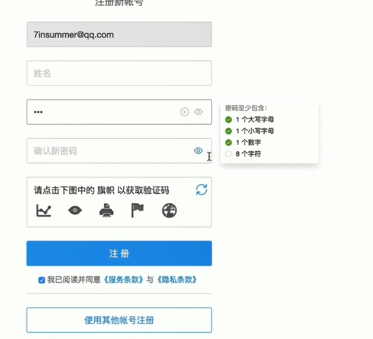
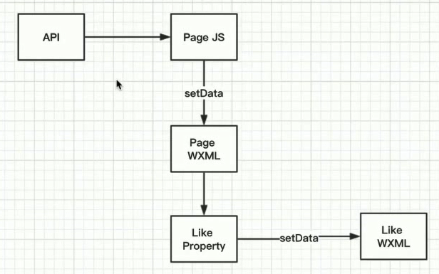

# 小程序进阶-临时

## appkey获取

github 关键词 旧岛

```json
const config = {
  api_blink_url: 'http://bl.7yue.pro/v1/',
  appkey: 'RdshydjBvcYZhMZC'
}
```

## 第六章

###  数据来源的三种途径

- WXML
- JS->WXML
- 服务器->JS-WXML

### 数据绑定

js 中，data 中存数据；WXML 中，通过 {{}} 绑定数据

### 三元表达式与图片切换

通过三元表达式控制图片或数据的切换

```html
// wxml
<image src="{{like?yesSrc : noSrc}}"  />
<text>{{like?count1:count2}}</text>
```

```js
// js
data: {
    like: true,
    count1: 99,
    count2: 999,
    yesSrc: 'images/like.png',
    noSrc: 'images/like2.png'
}
```

### 组件的封闭性，开放性及粒度

开放性：可以从组件外部进行设置，也就是通过  properties

### 组件的properties属性详解

```html
// wxml
<image src="{{like?yesSrc : noSrc}}"  />
<text>{{like?count1:count2}}</text>
```

```js
// js
Component({
    properties: {
        like:{
            type: Boolean
        },
        count:{
            type: Number
        }
    },
    data: {
        like: true,
        count1: 99,
        count2: 999,
        yesSrc: 'images/like.png',
        noSrc: 'images/like2.png'
    }
})
```

### let,var与组件事件应用

## 第七章

### 看待组件的两种观点

组件的好处：复用、代码分离

代码分离>复用

### 生命周期函数

### wx.request-4xx状态码并不会执行fail

### 合法域名问题

开发阶段可以不校验合法域名，但是上线后必须在小程序后台添加合法域名

### 访问API获取数据

```js
onLoad: function (options) {
    wx.request({
        url：'',
        header: {
        	appkey: ''
    	}
    })
}
```

开发阶段应该对上述请求函数进行封装，直接写是不可取的。

### 正确理解 Promise

应用场景：

- 解决异步嵌套的问题-回调地狱
- 利用 return

### 模块化导入公共配置文件

根目录新建 config.js 文件

存储公共数据，并使用 `export` 导出

```js
export const config = {
    api_base_url: 'http://bl.7yue.pro/v1/',
    appkey: "RdshydjBvcYZhMZC"
}
```

使用 ES Module export 与 import 导入公共数据

新建 util/http.js，定义一个 http 类，封装 request 请求方法，公共配置数据通过 `import `引入

```js
import {config} from '/config.js'
class HTTP {
    request (params) {
        // url, data, method
        wx.request({
            url
        })
    }
}
```

**导出多个数据与引入多个数据**

**导出**

```js
// config.js
export const config = {}
export let fn1 = function () {}
```

或

```js
// config.js
const config = {}
let fn1 = function () {}

export {conifg, fn1}
```

导出时，改名字

```js
export {config as config1}
```


**引入**

```js
import {config, fn1} from '/config.js'
```

引入时，改名字

```js
import {config as config1, fn1} from '/config.js'
```

### HTTP类的封装与ES6 startsWith

```js
import {config} from '/config.js'

class HTTP {
    request (params) {
        // url, data, method
        if (!params.method) {
            params.method = "GET"
        }
        wx.request({
            url: config.api_base_url + params.url,
            method: params.method,
            data:params.data,
            header: {
                'content-type':'application/json',
                'appkey': config.appkey
            },
            success: (res) => {
                let code = res.statusCode.toString()
                // 拿到字符串的首字母
                // var startChar = code.charAt(0)
                // if (startChar == '2') {}
                if (code.startsWith('2')) {
                    // 回调函数传递
                    params.success(res.data)
                } else {
                    // 服务器异常
                }
            },
            fail: (err) => {
                // api 调用失败
            }
        })
    }
}

export {HTTP}
```

注意：导出和引入只能使用相对路径

### 通用错误异常处理

好的反馈



```js
import {config} from '../config.js'

// request 函数代码已经很多，应该在进行拆分
const tip = {
    1： '抱歉，出现了一个错误',
    1005: 'appkey无效，请前往www.7yue.pro申请',
    3000: '期刊不存在'
}

class HTTP {
    request (params) {
        if (!params.method) {
            params.method = "GET"
        }
        wx.request({
            url: config.api_base_url + params.url,
            method: params.method,
            data:params.data,
            header: {
                'content-type':'application/json',
                'appkey': config.appkey
            },
            success: (res) => {
                let code = res.statusCode.toString()
                if (code.startsWith('2')) {
                    // 回调函数传递
                    params.success(res.data)
                } else {
                    // 服务器异常
                    // 根据文档，模拟 4xx 的错误情况
                    let error_code = res.data.error_code
                    this._show_error(error_code)
                }
            },
            fail: (err) => {
                // api 调用失败
                // 断网后，可看到效果
                this._show_error(1)
            }
        })   
    }
    
    // es6 没有提供私有函数的标准，这里通过下划线表示私有函数，只在函数内调用（自定义的私有函数可以再外部调用，不过不要这样做）
    _show_error (error_code) {
        if (!error_code) {
            error_code = 1
        }
        wx.showToast({
            title: tips[error_code],
            icon: 'none',
            duration: 2000
        })
    }
}

export {HTTP}
```

页面使用

比直接在页面写代码少很多，但这还不是最好的写法。

```js
import {HTTP} from '../../utils/http.js'

let http = new HTTP()

Page({
  onLoad: function (options) {
    http.request({
      url: 'classic/latest',
      success: (res) => {
        console.log(res)
      }
    })
  }
})
```

## 第八章

### 什么是'剥夺函数 return 的能力'

使用回调函数剥夺了函数 return 的能力

### 组件属性赋值与页面渲染流程解析



### setData 的误区

误区1：只有通过setData 设置的数据才能被 wxml 使用，这是错误的。

反例：如果 data 中有数据，是可以在 wxml 中显示数据的。

```js
data: {
    test: 1
}
```

对于页面或组件的 wxml，所能使用的数据完全取决于 data 中有什么数据，setData 用于数据更新(更新数据必须通过 setData，直接赋值操作无效)。

```js
// 无效
this.data.test =2
// 只能通过setData
this.setData({
    test: 2
})
```

若 data 中没有 setData 更新的数据项，setData 会先创建这个数据项然后再更新。凡是要被 wxml 使用的变量最好都在 data 中标识，如像异步操作更新的数据最好还是在 data 中设置默认值，否则数据没有请求回来前，页面无法正常显示。

### movie组件的实现

**vscode格式化css代码**：安装 Beautify 插件

css技术点

**不规则调整图片的位置**

```css
.tag {
  width: 46rpx;
  height: 142rpx;
}
/* 通过 relative 调整 */ 
.tag {
  width: 46rpx;
  height: 142rpx;
  position: relative;
  right: 310rpx;
  bottom: 58rpx;
}
```

**让文字换行并居中**

在整体居中的条件下，设置最大宽度 ` max-width: 550rpx;`，这样即使文字少也是会居中的

### 再谈组件的实现

组件的通用性

例如 http 请求这种业务性代码也该写在使用方，而就是 paga 页面中，而不应该写在组件中

### 自定义事件的激活与监听

通过 tap 事件不能把组件的数据传入页面，这时，需要用到自定义事件

通过 triggerEvent 自定义 like 事件，并通过第二个参数对象传参

```js
// like 组件内
methods: {
    onLike: function(event) {
      // 自定义事件
      // 激活
      let behavior = this.properties.like ? 'like' : 'cancel'
      this.triggerEvent('like', {
        behavior: behavior // 通过第二个参数对象进行传参
      }, {})
    }
  }
```
在页面中，监听 like 事件，并通过 event.detail 拿到数据
```html
<--页面内-->
    <v-like  bind:like="onLike" like="{{classic.like_status}}" count="{{classic.fav_nums}}"/>
```

```js
 onLike: function (event) {
    let behavior = event.detail.behavior
  },
```

### 喜欢还是不喜欢

判断是否存在，执行操作写法**

利用 && 短路操作，如果存在就执行，不存在就不执行

```js
// 利用 && 判断是否传入了 success 回调函数
params.success && params.success(res.data)
```

### 组件的生命周期

文档-框架-自定义组件-Component构造器

5个组件生命周期函数

### 组件的data与properties的奇怪现象

第一，可以看到在 properties 中可以使用 Number 或 String 当作默认值，而在data中**不可以**。

第二，properties 和 data 中的属性是一样的。所以微信会把 properties 和 data 合并成同一个 js 对象，当我们访问任意一个时，都指向同一个 js 对象。**注意**：properties 和 data 中不要出现同名属性，小程序合并时会覆盖掉。

```js
// 组件 js
Component({
  properties: {
    index: Number
  },
  data: {
    year: Number,
    month: String
  },

  attached: function(){
    console.log(this.properties) // {index: 0, year: ƒ, month: ƒ}
    console.log(this.data)       // {index: 0, year: ƒ, month: ƒ}
  }
})
```

所有 data 中的属性默认值设置可以是：

```js
data: {
    year: 0,
    month: ""
}
```

### 业务逻辑到底写组件里还是页面里


